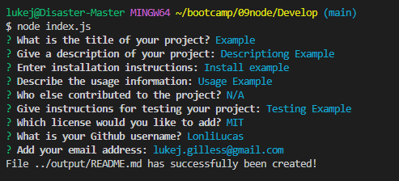

# 09node

## Description

A tool that gives prompts in the command prompt that will take your answers and generate a READEME.md file for your project.

## Installation

Download the project, move to the file and use "npm install" to install node and "npm i inquirer@8.2.4" to install the inquirer packack in the 09Node/Develop directory. 

## Usage

Use bash to go to the directory containing the program, then use command "node index.js" to run the program. Then just answer the prompts!

